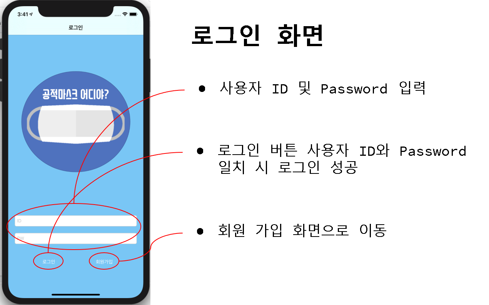
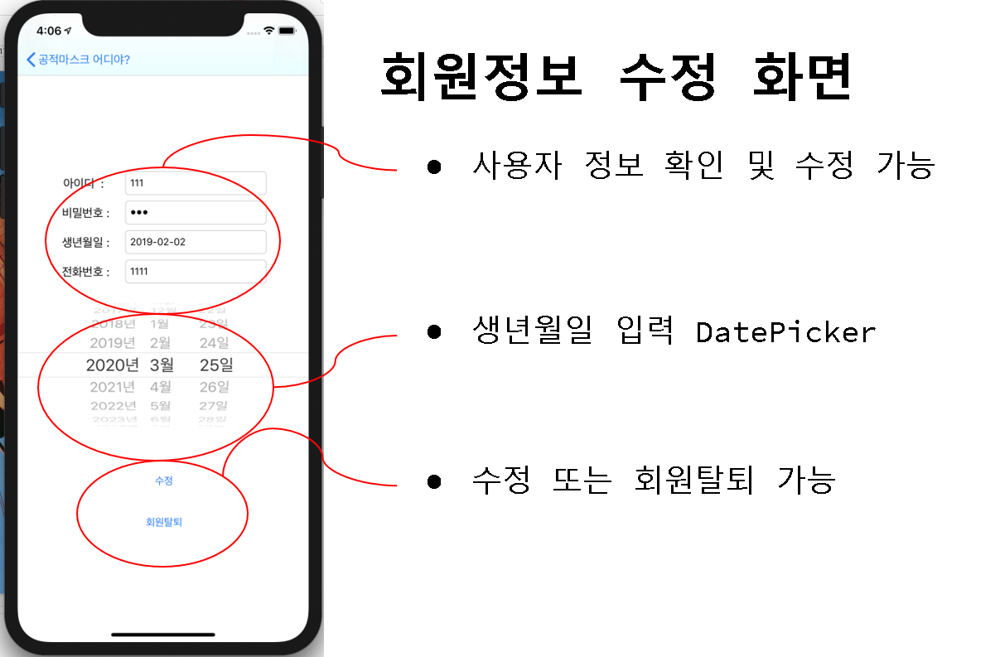
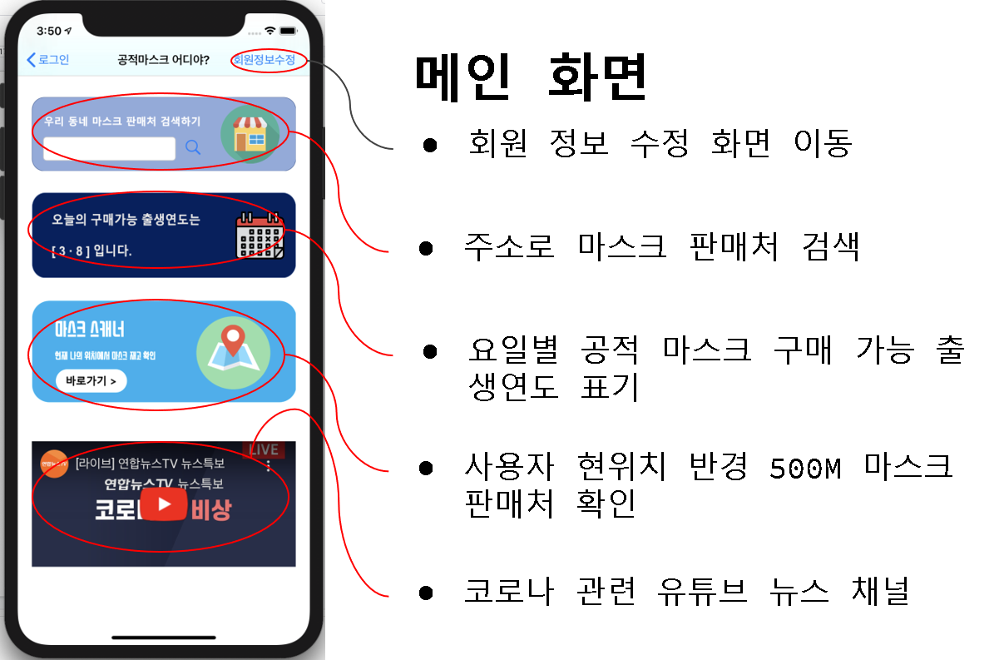
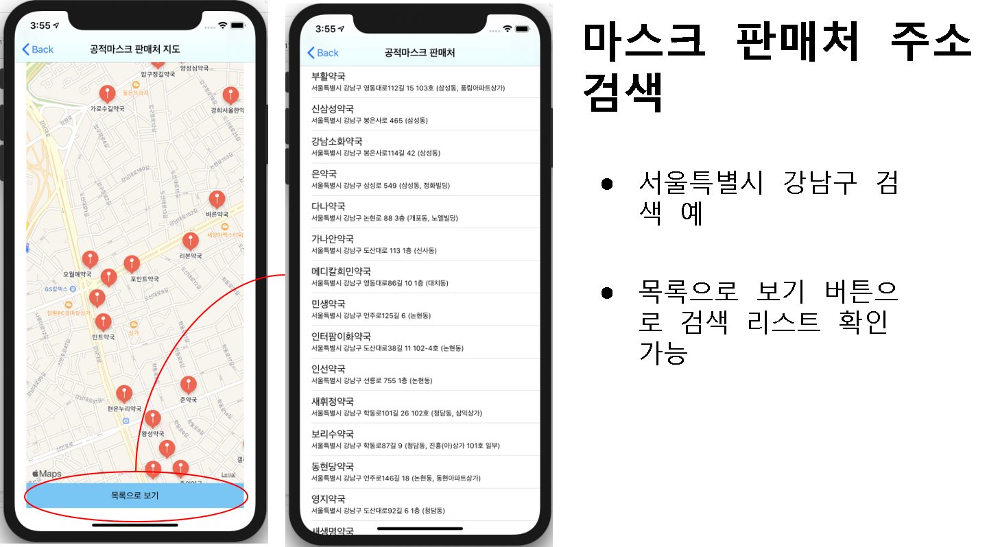
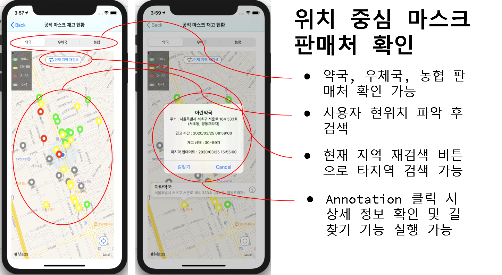
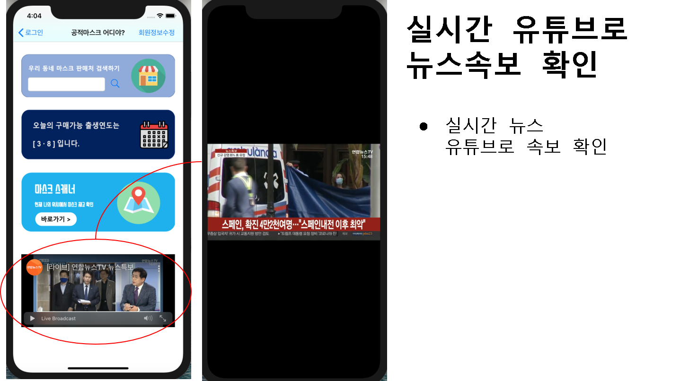

## LeeHoJun`s Portfolio Page

LeeHojun`s Project Portfolio Page입니다.

### ALL Project Common Development Environment

### Web Project(Spring Mvc Project)
Web Project(ExamBank)

- The reason why I created this project    
각종 기출문제 시험에 관하여 실전과 같은 문제를 풀어볼 수 있도록 하고 해설도 볼 수 있도록 하는 사이트가 필요해보였습니다.    
사용자들이 각종 시험들의 회차별 기출문제를 구입하여 직접 풀어보고 채점기능을 활용할 수 있고 오답 및 해설 확인, QnA게시판을 활용한 질문/답변의 활용을 할 수 있습니다.    
관리자는 회원정보 관리 및 게시판 관리, 과목 및 문제 추가 수정등을 할 수 있습니다.

- Web Project Development Environment    

### Android Project(Android Native Application)
Android Project(Famous Food Stores from Lee Young Ja`s Choice)

- The reason why I created this project    
방송에서 개그우먼 이영자씨의 맛집 추천이 자주 나오고 있는데 이러한 맛집들을 정리하여 알려주는 애플리케이션이 필요하다고 생각하여 만들어 보았습니다.

- Android Project DevelopMent Environment    

### Ios Project(Ios Native Application)
Ios Project(Covid 19 Public Mask)

- The reason why I created this project       
현재 코로나19의 문제로 마스크를 구하기 어려워진 상황에서 공적 마스크 공급이 시작되었지만 값이 싸고 물량이 제한적이라 구하기 어려운 환경입니다.    
이러한 환경속에 정부에서는 공적마스크 판매처와 마스크 재고량을 실시간 확인할 수 있는 공공데이터를 제공함으로써 다양한 개발자들이 활용할 수 있게 되었습니다.     
저희 앱은 마스크 판매처 정보와 물량 그리고 현재 사용자 위치에서 판매처까지의 길을 찾아주어 사용자가 편리하게 공적마스크 정보를 얻을 수 있게 하였습니다.   

- Ios Project Development Environment    

- Ios Project Running Process     

- Ios Project Running Video    
<a href="https://drive.google.com/file/d/1mJeopBKvb8hjLbhPa_UnmwcdCFyGvIwh/view?usp=sharing">Watch Running Video</a>

### Final Project(Web + Android + Ios)
Final Project(Covid19)

- The reason why I created this project    
코로나의 감염이 전 세계적으로 여러 곳에서 동시 다발적으로 확산되고,    
사태의 장기화 가능성이 커지면서 코로나 관련 앱이 제공하는 정보와 기능도 다양화되어야 합니다.    
기존 코로나 관련 앱을 비교하였을때 공적마스크 재고 확인만 가능한 앱만 다수 있으며, 정보공유가 부족합니다.    
따라서 기존 공적마스크 재고 확인 기능 및 코로나 관련 정보(오픈채팅, QnA 챗봇, 코로나 확진자 현황)등 전문성 있는 앱이 필요하여 개발하게 되었습니다.

- Final Project Development Environment    

 

- Final Project Running Video    
<a href="https://drive.google.com/open?id=1WLrp7p_M_miftCXBl3dQeASRd3-7yRXa">Watch Running Video(Web)</a> 
<a href="https://drive.google.com/open?id=14qlGK0ooWAeg_A4y5xCzdCESXd6siXaV">Watch Running Video(Android)</a> 
<a href="https://drive.google.com/open?id=1Eh_gw-cLD_acwRiy7SkrWB69HspKBFCp">Watch Running Video(Ios)</a>
